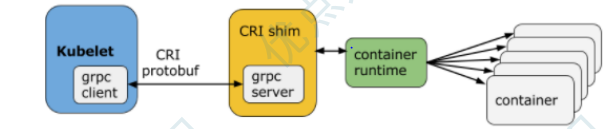
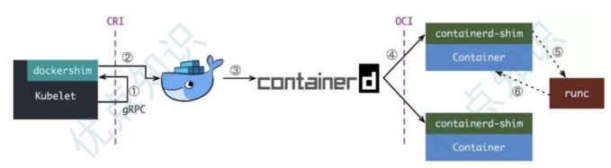
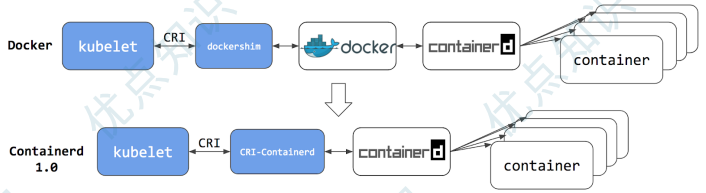

首先我们要明确一个知识点就是 **容器本质上就是一个进程** ，一个特殊的进程，是通过 Namespace 实现资源（网络、文件系统等）隔离，通过 Cgroups 实现资源（CPU、内存）限制，让我们使用起来就感觉像在操作虚拟机一样，但其和虚拟机有本质上的区别，那就是**容器和宿主机是共享同一个内核**的。为了将我们的应用进程运行在容器中，当然就需要有一些方
便的接口或者命令去调用 Linux 的系统功能来实现，而容器运行时就是用来运行和管理容器进程、镜像的工具。

## 容器运行时分类
当然最火大家最熟悉的容器运行时非 Docker 莫属了，Docker 凭借一己之力大大推进了容器技术的普及。当然随着容器生态的不断发展，业界也慢慢出现了其他的运行时，比如 Containerd、rkt、kata container、cri-o 等等，这些运行时提供的功能不尽相同，有些只有容器运行的功能，有些除运行容器之外还提供了容器镜像的管理功能。根据容器运行时提供的功能，我们可以将**容器运行时分为低层运行时和高层运行时**

低层运行时主要负责与宿主机操作系统打交道，根据指定的容器镜像在宿主机上运行容器进程，并**对容器的整个生命周期进
行管理**，也就是负责设置容器 Namespace、Cgroups 等基础操作的组件，常见的低层运行时有：
- **runc** ：传统的运行时，基于 Linux Namespace 和 Cgroups 技术实现，代表实现 Docker、Containerd
- **runv** ：基于虚拟机管理程序的运行时，通过虚拟化 guest kernel，将容器和主机隔离开来，使得其边界更加清晰，
代表实现是 Kata Container 和 Firecracker
- **runsc** ：runc + safety，通过拦截应用程序的所有系统调用，提供安全隔离的轻量级容器运行时沙箱，代表实现是
谷歌的 gVisor

高层运行时主要负责镜像的管理等工作，为容器的运行做准备，主流的高层运行时包括 Containerd、CRI-O。高层运行
时与低层运行时各司其职，容器运行时一般先由高层运行时将容器镜像下载下来，并解压转换为容器运行需要的操作系统文
件，再由低层运行时启动和管理容器

## CRI
Kubernetes 中提供了一个叫着 CRI 的容器运行时接口，那么这个 CRI 到底是什么呢？这个其实也和 Docker 的发展
密切相关的。
在 Kubernetes 早期的时候，当时 Docker 实在是太火了，Kubernetes 当然会先选择支持 Docker，而且是通过硬编
码的方式直接调用 Docker API，后面随着 Docker 的不断发展以及 Google 的主导，出现了更多容器运行时，
Kubernetes 为了支持更多更精简的容器运行时，Google 就和红帽主导推出了 CRI 标准，用于将 Kubernetes 平台和
特定的容器运行时（当然主要是为了干掉 Docker）解耦。

CRI（Container Runtime Interface 容器运行时接口）本质上就是 Kubernetes 定义的一组与容器运行时进行交
互的接口，所以只要实现了这套接口的容器运行时都可以对接到 Kubernetes 平台上来。不过 Kubernetes 推出 CRI
这套标准的时候还没有现在的统治地位，所以有一些容器运行时可能不会自身就去实现 CRI 接口，于是就有了 shim（垫
片） ， 一个 shim 的职责就是作为适配器将各种容器运行时本身的接口适配到 Kubernetes 的 CRI 接口上，其中
dockershim 就是 Kubernetes 对接 Docker 到 CRI 接口上的一个垫片实现。

从上图可以看到，CRI 主要有 gRPC client、gRPC Server 和具体的容器运行时三个组件。其中 Kubelet 作为
gRPC 的客户端来调用 CRI 接口；CRI shim 作为 gRPC 服务端来响应 CRI 请求，负责将 CRI 请求的内容转换为具体
的容器运行时 API，在 kubelet 和运行时之间充当翻译的角色。具体的容器创建逻辑是，Kubernetes 在通过调度指定
一个具体的节点运行 Pod，该节点的 Kubelet 在接到 Pod 创建请求后，调用一个叫作 GenericRuntime 的通用组件
来发起创建 Pod 的 CRI 请求给 CRI shim；CRI shim 监听一个端口来响应 Kubelet，在收到 CRI 请求后，将其转
化为具体的容器运行时指令，并调用相应的容器运行时来创建 Pod
## 为何抛弃 Docker
Docker 最初是一个单体引擎，主要负责容器镜像的制作、上传、拉取及容器的运
行及管理。随着容器技术的繁荣发展，为了促进容器技术相关的规范生成和 Docker 自身项目的发展，Docker 将单体引擎
拆分为三部分，分别为 runc 、containerd 和 dockerd，其中 runc 主要负责容器的运行和生命周期的管理、
containerd 主要负责容器镜像的下载和解压等镜像管理功能、dockerd 主要负责提供镜像构建、上传等功能同时提供
容器存储和网络的映射功能，同时也是 Docker 服务器端的守护进程，用来响应 Docker 客户端发来的各种容器、镜像管
理的任务。Docker 公司将 runc 捐献给了 OCI，将 containerd 捐献给了 CNCF，剩下的 dockerd 作为 Docker
运行时由 Docker 公司自己维护
如前所述，Kubernetes 在引入 CRI 之后，kubelet 需要通过 CRI shim 去调用具体的容器运行时工具，由于早期
Kubernetes 对 Docker 的支持是内置的，因此官方自己实现了 dockershim，通过 dockershim 去访问 dockerd

假设我们使用的是 Docker，当我们在 Kubernetes 中创建一个 Pod 的时候，首先就是 kubelet 通过 CRI 接口调用
dockershim，请求创建一个容器，kubelet 可以视作一个简单的 CRI Client, 而 dockershim 就是接收请求的
Server，不过他们都是在 kubelet 内置的。
dockershim 收到请求后, 转化成 dockerd 能识别的请求, 发到 Docker Daemon 上请求创建一个容器，请求到了
Docker Daemon 后续就是 Docker 创建容器的流程了，去调用 Containerd，然后创建 Containerd-shim 进程，
通过该进程去调用 runc 去真正创建容器。
其实我们仔细观察也不难发现使用 Docker 的话其实是调用链太长，真正容器相关的操作其实 Containerd 就完全足够
了，Docker 太过于复杂笨重了，当然 Docker 深受欢迎的很大一个原因就是提供了很多对用户操作比较友好的功能，但是
对于 Kubernetes 来说压根不需要这些功能，因为都是通过接口去操作容器的，所以自然也就可以将容器运行时切换到
Containerd 

切换到 Containerd 可以消除掉中间环节，操作体验也和以前一样，但是由于直接用容器运行时调度容器，所以它们对
Docker 来说是不可见的。 因此，你以前用来检查这些容器的 Docker 工具就不能使用了。
你不能再使用 docker ps 或 docker inspect 命令来获取容器信息。由于不能列出容器，因此也不能获取日志、停止
容器，甚至不能通过 docker exec 在容器中执行命令。
当然我们仍然可以下载镜像，或者用 docker build 命令构建镜像，但用 Docker 构建、下载的镜像，对于容器运行时
和 Kubernetes，均不可见。为了在 Kubernetes 中使用，需要把镜像推送到镜像仓库中去。