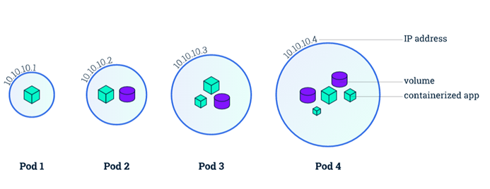
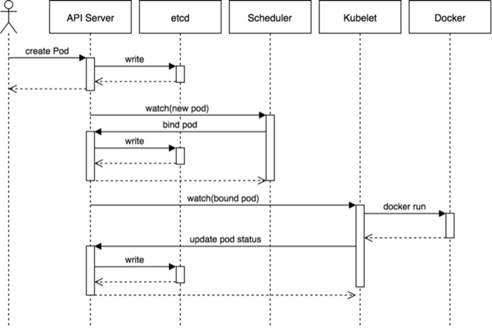
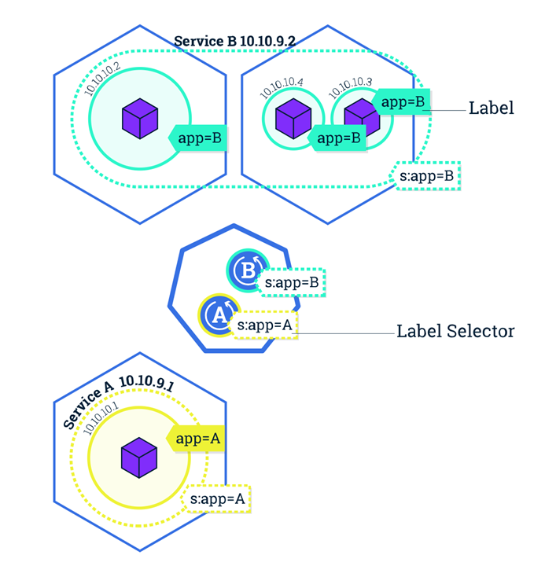

## 核心资源对象
####Pod
Pod 是一组紧密关联的容器集合 ，它们共享 PID、IPC、Network 和 UTS namespace，是 Kubernetes 调度的基本
单位。Pod 的设计理念是支持多个容器在一个 Pod 中共享网络和文件系统，可以通过进程间通信和文件共享这种简单高效
的方式组合完成服务。我们知道容器本质上就是进程，那么 Pod 实际上就是进程组了，只是这一组进程是作为一个整体来进行调度的



在kubernetes 中，所有资源对象都使用资源清单（yaml 或 json）来定义，比如我们可以定义一个简单的 nginx 服
务，它包含一个镜像为 nginx 的容器：(nginx-pod.yaml)
```yaml
apiVersion: v1
kind: Pod
metadata:
 name: nginx
 labels:
 app: nginx
spec:
 containers:
 - name: nginx
 image: nginx
 ports:
 - containerPort: 80
```
定义了这样一个资源清单文件后，我们就可以利用上面我们提到的 Kubectl 工具将这个 Pod 创建到 Kubernetes 集群中
```yaml
kubectl apply -f nginx-pod.yaml
```
Pod 在 Kubernetes 集群中被创建的基本流程如下所示：


- 用户通过 REST API 创建一个 Pod
- apiserver 将其写入 etcd
- scheduluer 检测到未绑定 Node 的 Pod，开始调度并更新 Pod 的 Node 绑定
- kubelet 检测到有新的 Pod 调度过来，通过 container runtime 运行该 Pod
- kubelet 通过 container runtime 取到 Pod 状态，并更新到 apiserver 中

####Label
Label 标签在 Kubernetes 资源对象中使用很多，也是非常重要的一个属性，Label 是识别 Kubernetes 对象的标
签，以 key/value 的方式附加到对象上（key 最长不能超过 63 字节，value 可以为空，也可以是不超过 253 字节
的字符串）上面我们定义的 Nginx 的 Pod 就添加了一个 app=nginx 的 Label 标签。Label 不提供唯一性，并且实
际上经常是很多对象（如 Pods）都使用相同的 Label 来标志具体的应用。Label 定义好后其他对象可以使用 Label
Selector 来选择一组相同 Label 的对象（比如 Service 用 Label 来选择一组 Pod）。Label Selector 支持以
下几种方式：
+ 等式，如 app=nginx 和 env!$production
+ 集合，如 env in (production, qa)
+ 多个 Label（它们之间是 AND关系），如 app=nginx,env=test

####Namespace
Namespace（命名空间）是对一组资源和对象的抽象集合，比如可以用来将系统内部的对象划分为不同的项目组或用户组。
常见的 Pods、Services、Deployments 等都是属于某一个 Namespace 的（默认是 default），比如上面我们的
Nginx Pod 没有指定 namespace，则默认就在 default 命名空间下面，而 Node, PersistentVolumes 等资源则
不属于任何 Namespace，是全局的

####Deployment
 Pod 是 Kubernetes 集群中的最基本的调度单元，但是如果想要创建同一个容器的多份拷贝，需要一个一个分
别创建出来么，那么能否将 Pods 划到一个逻辑组里面呢？Deployment 就是来管理 Pod 的资源对象。
Deployment 确保任意时间都有指定数量的 Pod“副本”在运行。如果为某个 Pod 创建了 Deployment 并且指定 3 个
副本，它会创建 3 个 Pod，并且持续监控它们。如果某个 Pod 不响应，那么 Deployment 会替换它，始终保持总数为
3。
如果之前不响应的 Pod 恢复了，现在就有 4 个 Pod 了，那么 Deployment 会将其中一个终止保持总数为 3。如果在
运行中将副本总数改为 5，Deployment 会立刻启动 2 个新 Pod，保证总数为 5。持回滚和滚动升级。
当创建 Deployment 时，需要指定两个东西：
+ Pod 模板：用来创建 Pod 副本的模板
+ Label 标签：Deployment 需要监控的 Pod 的标签

####Service
Service 是应用服务的抽象，通过 Labels 为应用提供 **负载均衡和服务发现**。匹配 Labels 的 Pod IP 和端口列表组
成 Endpoints，由 kube-proxy 负责将服务 IP 负载均衡到这些 Endpoints 上。
每个 Service 都会自动分配一个 cluster IP（仅在集群内部可访问的虚拟地址）和 DNS 名，其他容器可以通过该地址
或 DNS 来访问服务，而不需要了解后端容器的运行
