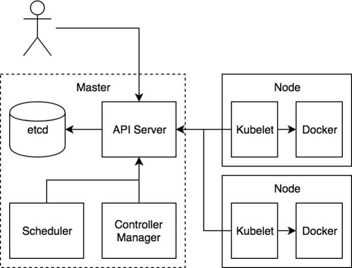
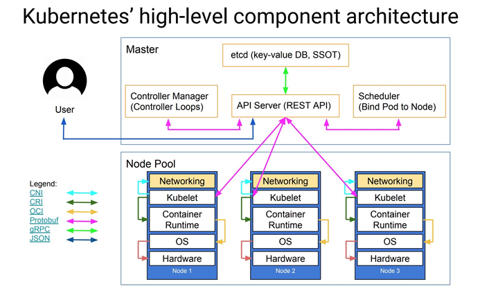

## 架构
Kubernetes 由 Master 和 Node 两种节点组成，这两种角色分别对应着控制节点和工作节点

其中 Master 节点由三个独立的组件组成，它们分别是负责整个集群通信的 API 服务的 kube-apiserver、负责容器
调度的 kube-scheduler 以及负责维护集群状态的 kube-controller-manager 组件。整个集群的数据都是通过
kube-apiserver 保存到 etcd 数据库中的，而其他所有组件的通信也都是通过 kube-apiserver 和 etcd 数据库进
行通信的，都不会直接和 etcd 进行通信
工作节点上最核心的组件就是 kubelet，当然还有底层的容器运行时，比如 Docker，其中 kubelet 就是主要来实现和
底层的容器运行时进行通信的，这个通信的过程也被 Kubernetes 抽象成了一个 CRI （Container Runtime
Interface）的远程调用接口，这个接口里面定义了容器运行时的所有标准操作，比如创建容器、删除容器等等
kubelet 的另外一个重要功能就是调用网络插件（CNI ）和存储插件（ CSI ）为容器配置网络和存储功能，同样的
kubelet 也是把这两个重要功能通过接口暴露给外部了，所以如果我们想要实现自己的网络插件，只需要使用 CNI 就可以很方便的对接到 Kubernetes 集群当中

### 组件
####kube-apiserver
API Server 提供了资源对象的唯一操作入口，其它所有组件都必须通过它提供的 API 来操作资源数据。只有 API
Server 会与 etcd 进行通 进行通信信，其，其它模块都 它模块都必须必须通过通过 API Server 访问集群状态。API Server 作为
Kubernetes 系统的入口，封装了核心对象的增删改查操作。API Server 以 RESTFul 接口方式提供给外部客户端和内
部组件调用，API Server 再对相关的资源数据（全量查询 + 变化监听 ）进行操作，以达到实时完成相关的业务功能。以
API Server 为 Kubernetes 入口的设计主要有以下好处：
+ 保证了集群状态访问的安全
+ API Server 隔离了集群状态访问和后端存储实现，这样 API Server 状态访问的方式不会因为后端存储技术 Etcd
的改变而改变，让后端存储方式选择更加灵活，方便了整个架构的扩展

####kube-controller-manager

Controller Manager 用于实现 Kubernetes 集群故障检测和恢复的自动化工作。主要负责执行各种控制器：
+ Replication Controller：主要是定期关联 Replication Controller (RC) 和 Pod，以保证集群中一个 RC
(一种资源对象) 所关联的 Pod 副本数始终保持为与预设值一致
+ Node Controller：Kubelet 在启动时会通过 API Server 注册自身的节点信息，并定时向 API Server 汇报
状态信息。API Server 在接收到信息后将信息更新到 Etcd 中。Node Controller 通过 API Server 实时获取
Node 的相关信息，实现管理和监控集群中的各个 Node 节点的相关控制功能
+ Namespace Controller：用户通过 API Server 可以创建新的 Namespace 并保存在 Etcd 中，Namespace
Controller 定时通过 API Server 读取这些 Namespace 信息来操作 Namespace。比如：Namespace 被 API
标记为优雅删除，则将该 Namespace 状态设置为 Terminating 并保存到 Etcd 中。同时 Namespace
Controller 删除该 Namespace 下的 ServiceAccount、Deployment、Pod 等资源对象
+ Service Account Controller：服务账号控制器主要在命名空间内管理 ServiceAccount，以保证名为
default 的 ServiceAccount 在每个命名空间中存在
+ Token Controller：令牌控制器作为 Controller Manager 的一部分，主要用作：监听 serviceAccount 的
创建和删除动作以及监听 secret 的添加、删除动作
+ Service Controller：服务控制器主要用作监听 Service 的变化。比如：创建的是一个 LoadBalancer 类型的
Service，Service Controller 则要确保外部的云平台上对该 Service 对应的 LoadBalancer 实例被创建、
删除以及相应的路由转发表被更新
+ Endpoint Controller：Endpoints 表示了一个 Service 对应的所有 Pod 副本的访问地址，而 Endpoints
Controller 是负责生成和维护所有 Endpoints 对象的控制器。Endpoint Controller 负责监听 Service 和
对应的 Pod 副本的变化。定期关联 Service 和 Pod (关联信息由 Endpoint 对象维护)，以保证 Service 到
Pod 的映射总是最新的

####kube-scheduler
Scheduler 是负责整个集群的资源调度的，主要的职责如下所示：
- 主要用于收集和分析当前 Kubernetes 集群中所有 Node 节点的资源 (包括内存、CPU 等) 负载情况，然后依据资
源占用情况分发新建的 Pod 到 Kubernetes 集群中可用的节点
- 实时监测 Kubernetes 集群中未分发和已分发的所有运行的 Pod
- 实时监测 Node 节点信息，由于会频繁查找 Node 节点，所以 Scheduler 同时会缓存一份最新的信息在本地
- 在分发 Pod 到指定的 Node 节点后，会把 Pod 相关的 Binding 信息写回 API Server，以方便其它组件使用

####kubelet
kubelet 是负责容器真正运行的核心组件，主要的职责如下所示：
- 负责 Node 节点上 Pod 的创建、修改、监控、删除等全生命周期的管理
- 定时上报本地 Node 的状态信息给 API Server
- kubelet 是 Master 和 Node 之间的桥梁，接收 API Server 分配给它的任务并执行
- kubelet 通过 API Server 间接与 Etcd 集群交互来读取集群配置信息
- kubelet 在 Node 上做的主要工作具体如下：
    1. 设置容器的环境变量、给容器绑定 Volume、给容器绑定 Port、根据指定的 Pod 运行一个单一容器、给指定的Pod 创建 Network 容器
    2. 同步 Pod 的状态
    3. 在容器中运行命令、杀死容器、删除 Pod 的所有容器

####kube-proxy
kube-proxy 是为了解决外部网络能够访问集群中容器提供的应用服务而设计的，Proxy 运行在每个 Node 上。
每创建一个 Service，kube-proxy 就会从 API Server 获取 Services 和 Endpoints 的配置信息，然后根据其
配置信息在 Node 上启动一个 Proxy 的进程并监听相应的服务端口。
当接收到外部请求时，kube-proxy 会根据 Load Balancer 将请求分发到后端正确的容器处理。
kube-proxy 不但解决了同一宿主机相同服务端口冲突的问题，还提供了 Service 转发服务端口对外提供服务的能力。
kube-proxy 后端使用随机、轮循等负载均衡算法进行调度。

####kubectl
Kubectl 是 Kubernetes 的集群管理命令行客户端工具集。通过 Kubectl 命令对 API Server 进行操作，API
Server 响应并返回对应的命令结果，从而达到对 Kubernetes 集群的管理