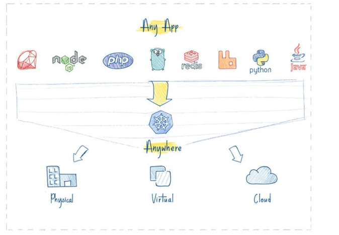
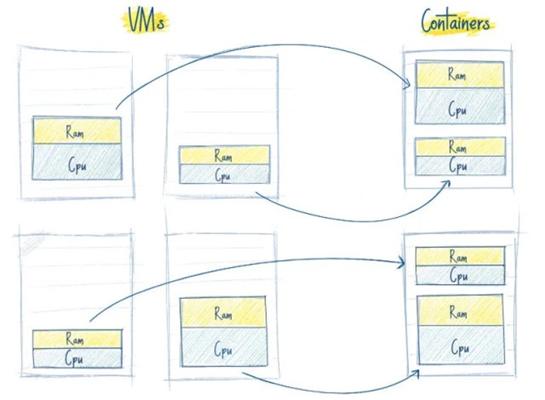
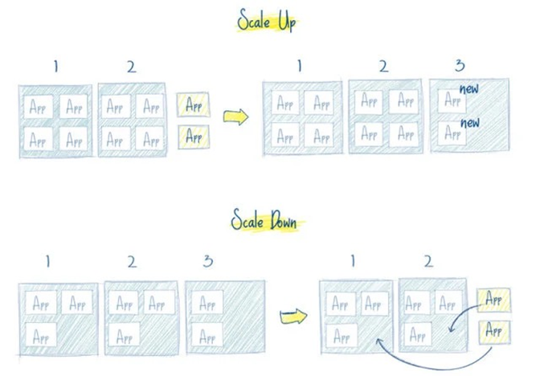
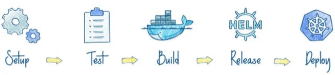
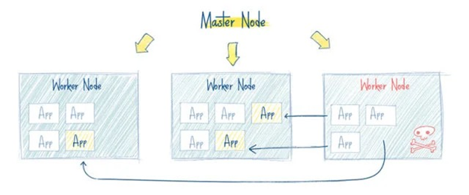

## 为何使用K8S
使用 Kubernetes 的理由很多，最重要的理由是，IT 行业从来都是由新技术驱动的。Docker 容器化技术已经被很多公
司采用，从单从单机机走走向集群已成 向集群已成为为必必然然。云计算的蓬勃发展正在加速这一进程，Kubernetes 作为当前被业界广泛认可和看
好的基于 Docker 的大规模容器化分布式系统解决方案

**一个平台搞定所有**

使用 Kubernetes 部署任何应用都是小菜一碟。只要应用可以打包成镜像，能够容器部署，Kubernetes 就一定能启动它。管什么语言、什么框架写的应用（如 Java, Python, Node.js），Kubernetes 都可以在任何环境中安全的启动它，
如物理服务器、虚拟机、云环境。

**云环境无缝迁移**

Kubernetes 完全兼容各种云服务提供商，例如 Google Cloud、Amazon、Microsoft Azure、阿里云等，还可以工作在 CloudStack, OpenStack, VSphere 上等

**高效的利用资源**

kubernetes 如果发现有节点工作不饱和，便会重新分配 Pod，帮助我们节省开销，高效的利用内存、处理器等资源。
如果一个节点宕机了，Kubernetes 会自动重新创建之前运行在此节点上的 Pod，在其他节点上运行

**开箱即用的自动缩放能力**

网络、负载均衡、复制等特性，对于 Kubernetes 都是开箱即用的。
Pod 是无状态运行的，任何时候有 Pod 宕了，立马会有其他 Pod 接替它的工作，用户完全感觉不到。
如果用户量突然暴增，现有的 Pod 规模不足了，那么会自动创建出一批新的 Pod，以适应当前的需求。
反之亦然，当负载降下来的时候，Kubernetes 也会自动缩减 Pod 的数量。

**使 DevOps 更简单**

不必精通 Chef 或 Ansible 这类工具，只需要对 CI 服务写个简单的脚本然后运行它，就会使用你的代码创建一个新的 Pod，并部署到 Kubernetes 集群里面。

**可靠性**

kubernetes 如此流行的一个重要原因是：应用会一直顺利运行，不会被 Pod 或节点的故障所中断。
如果出现故障，Kubernetes 会创建必要数量的应用镜像，并分配到健康的 Pod 或节点中，直到系统恢复。
一个容器化的基础设施是有自愈能力的，可以提供应用程序的不间断操作，即使一部分基础设施出现故障
